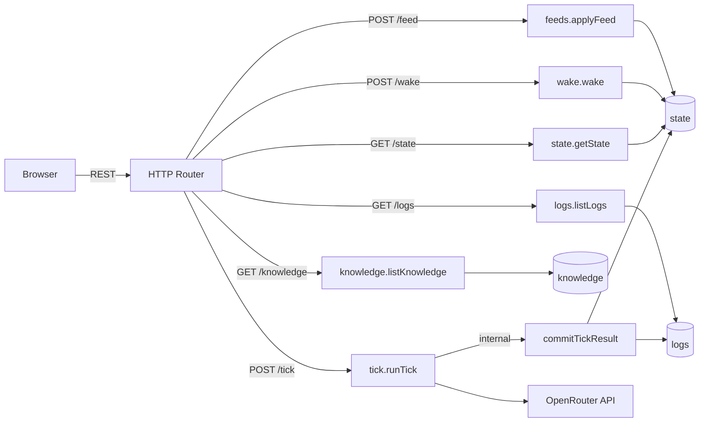
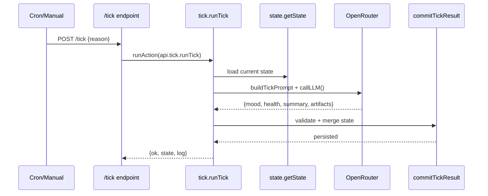

## Live Demo

Experience ClarkOS in action at [clark.wiki](https://clark.wiki) - a fully functional autonomous agent running 24/7.

<CardGroup cols={2}>
  <Card title="Main Repository" icon="github" href="https://github.com/clarkOS/clark">
    github.com/clarkOS/clark
  </Card>
  <Card title="Live Demo" icon="globe" href="https://clark.wiki">
    clark.wiki
  </Card>
</CardGroup>

## System Architecture

ClarkOS follows a modern serverless architecture with Convex as the backend infrastructure.

```
┌─────────────────────────────────────────────────────────────────┐
│                        Frontend (Next.js)                        │
│  ┌──────────┐ ┌──────────┐ ┌──────────┐ ┌──────────┐           │
│  │   Home   │ │  Market  │ │  Gallery │ │Knowledge │  ...      │
│  └────┬─────┘ └────┬─────┘ └────┬─────┘ └────┬─────┘           │
└───────┼────────────┼────────────┼────────────┼──────────────────┘
        │            │            │            │
        ▼            ▼            ▼            ▼
┌─────────────────────────────────────────────────────────────────┐
│                    Convex HTTP Router                            │
│  /state  /logs  /knowledge  /feed  /wake  /tick  /health        │
└─────────────────────────────────────────────────────────────────┘
        │
        ▼
┌─────────────────────────────────────────────────────────────────┐
│                    Convex Functions                              │
│  ┌─────────────┐  ┌─────────────┐  ┌─────────────┐             │
│  │   Queries   │  │  Mutations  │  │   Actions   │             │
│  │ state.get   │  │ state.patch │  │ tick.run    │             │
│  │ logs.list   │  │ feeds.apply │  │ consciousness│             │
│  │ knowledge   │  │ wake.wake   │  │ reflection  │             │
│  └─────────────┘  └─────────────┘  └─────────────┘             │
└─────────────────────────────────────────────────────────────────┘
        │
        ▼
┌─────────────────────────────────────────────────────────────────┐
│                    Convex Tables                                 │
│  ┌────────┐ ┌────────┐ ┌──────────┐ ┌────────┐ ┌─────────┐    │
│  │ state  │ │  logs  │ │ memories │ │knowledge│ │paintings│    │
│  └────────┘ └────────┘ └──────────┘ └────────┘ └─────────┘    │
└─────────────────────────────────────────────────────────────────┘
        │
        ▼
┌─────────────────────────────────────────────────────────────────┐
│                    External Services                             │
│  ┌──────────────┐  ┌──────────────┐  ┌──────────────┐          │
│  │  OpenRouter  │  │    Gemini    │  │  Polymarket  │          │
│  │  (LLM API)   │  │ (Embeddings) │  │ (Predictions)│          │
│  └──────────────┘  └──────────────┘  └──────────────┘          │
└─────────────────────────────────────────────────────────────────┘
```

## Demo App Routes

The live demo at [clark.wiki](https://clark.wiki) showcases the full capabilities of ClarkOS:

### Core Pages

| Route | Description |
|-------|-------------|
| [/](https://clark.wiki) | **Home** - Main ClarkOS interface with agent state, activity log, and real-time updates |
| [/dashboard](https://clark.wiki/dashboard) | **Dashboard** - Comprehensive overview of agent health, mood, and metrics |
| [/clark](https://clark.wiki/clark) | **Agent View** - Direct interface with the CLARK agent |

### Data & Intelligence

| Route | Description |
|-------|-------------|
| [/knowledge](https://clark.wiki/knowledge) | **Knowledge Graph** - Interactive 3D visualization of agent knowledge with search and filtering |
| [/news](https://clark.wiki/news) | **News Feed** - AI-curated headlines from Hacker News, BBC, 4chan, and more |
| [/market](https://clark.wiki/market) | **Market Terminal** - Real-time token tracking and prediction market analysis |
| [/polymarket](https://clark.wiki/polymarket) | **Polymarket** - Prediction market integration with agent opinions |

### Creative Output

| Route | Description |
|-------|-------------|
| [/gallery](https://clark.wiki/gallery) | **3D Gallery** - Wolfenstein-style walkthrough of AI-generated paintings |
| [/art](https://clark.wiki/art) | **Art Studio** - Agent's creative output and procedural artwork |

### Utility Pages

| Route | Description |
|-------|-------------|
| [/calendar](https://clark.wiki/calendar) | **Calendar** - Agent schedule and routine visualization |
| [/wallet](https://clark.wiki/wallet) | **Wallet** - Blockchain wallet integration |
| [/changelog](https://clark.wiki/changelog) | **Changelog** - Development history and updates |
| [/menu](https://clark.wiki/menu) | **Menu** - Navigation hub |

## Request/Response Flow



## Tick Orchestration

The tick cycle is the heartbeat of CLARK:



## Data Model

### State (Singleton)

The agent maintains a single state document:

| Field | Type | Description |
|-------|------|-------------|
| `mood` | string | Current emotional state |
| `health` | number | 0-100 operational capacity |
| `routine` | string | Time awareness (morning, day, evening, overnight) |
| `volatility` | number | 0-1 behavioral variance |
| `cryo` | boolean | Hibernation mode |
| `counters` | object | { ticks, feeds } |

### Memories

Five types with vector embeddings for semantic search:

| Type | Dedup Threshold | Purpose |
|------|-----------------|---------|
| episodic | 0.92 | Specific events |
| semantic | 0.95 | Facts and concepts |
| emotional | 0.88 | Feelings about topics |
| procedural | 0.97 | Learned patterns |
| reflection | 0.90 | Self-insights |

### Knowledge

External information ingested by the agent:

| Field | Description |
|-------|-------------|
| `type` | news, market, prediction, art, journal, etc. |
| `source` | Origin (HN, BBC, Polymarket, etc.) |
| `text_excerpt` | Content preview |
| `safety_label` | Content safety classification |

## Authentication

Protected endpoints use Bearer tokens:

| Token | Protects |
|-------|----------|
| `TICK_TOKEN` | `/tick` endpoint |
| `WRITE_TOKEN` | `/feed`, `/wake`, `/knowledge` |

```bash
curl -X POST https://your-project.convex.cloud/tick \
  -H "Authorization: Bearer YOUR_TICK_TOKEN"
```

## Local Development

```bash
# Clone the repository
git clone https://github.com/clarkOS/clark
cd clark

# Install dependencies
npm install

# Start development server
npm run dev
```

The dev server runs Convex locally at `http://127.0.0.1:8787`.

## Next Steps

<CardGroup cols={2}>
  <Card title="Quickstart" href="/quickstart">
    Deploy your own agent
  </Card>
  <Card title="Core Concepts" href="/concepts/agents">
    Understand the architecture
  </Card>
  <Card title="Example Agent" href="https://github.com/clarkOS/clark/tree/main/example/convex">
    View the source code
  </Card>
  <Card title="API Reference" href="/api-reference/introduction">
    Complete API documentation
  </Card>
</CardGroup>
